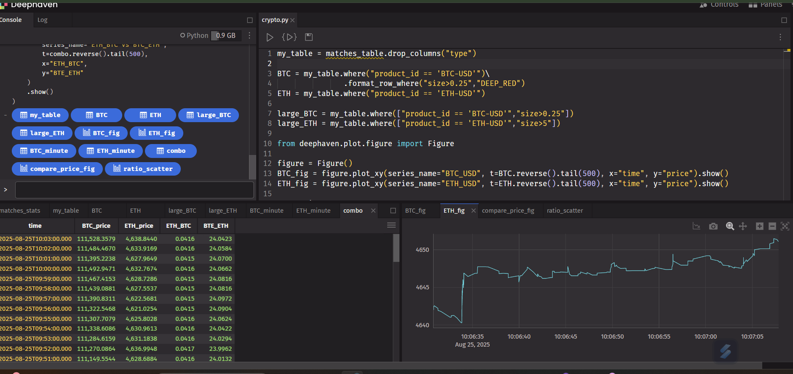

# Real-Time Cryptocurrency Data Visualization Using Deephaven Framework
This project provides real-time visualization of cryptocurrency price data for **Bitcoin (BTC)** and **Ethereum (ETH)** using the **Deephaven** Python framework. It includes price tracking, minute-level aggregation, and comparative analysis between BTC and ETH. Features include real-time price tracking, large trade highlighting (BTC trades > 0.25, ETH trades > 5), minute-level aggregation using `lowerBin` and `avg_by`, comparative analysis of BTC/ETH ratios, line plots for BTC and ETH over time, bar charts comparing prices, and scatter plots of BTC/ETH vs ETH/BTC ratios. To install, run `pip install deephaven` and clone the repository with `git clone https://github.com/yourusername/Real-Time-Cryptocurrency-Data-Visualization.git` and `cd Real-Time-Cryptocurrency-Data-Visualization`. Usage: Load and filter data with `BTC = my_table.where("product_id == 'BTC-USD'").format_row_where("size>0.25", "DEEP_RED")` and `ETH = my_table.where("product_id == 'ETH-USD'")`, filter large trades with `large_BTC = my_table.where(["product_id == 'BTC-USD'", "size>0.25"])` and `large_ETH = my_table.where(["product_id == 'ETH-USD'", "size>5"])`. Plot BTC and ETH price trends using `from deephaven.plot.figure import Figure`, then `figure = Figure()`, `BTC_fig = figure.plot_xy(series_name="BTC_USD", t=BTC.reverse().tail(500), x="time", y="price").show()`, and `ETH_fig = figure.plot_xy(series_name="ETH_USD", t=ETH.reverse().tail(500), x="time", y="price").show()`. Aggregate data by minute with `nanos_minute = 60_000_000_000`, `BTC_minute = BTC.select(["time","price"]).update("time = lowerBin(time, nanos_minute)").avg_by("time").rename_columns("BTC_price = price")`, and `ETH_minute = ETH.select(["time","price"]).update("time = lowerBin(time, nanos_minute)").avg_by("time").rename_columns("ETH_price = price")`. Join BTC and ETH data with `combo = BTC_minute.join(table=ETH_minute, on="time")` and `combo = combo.update(["ETH_BTC = ETH_price / BTC_price", "BTE_ETH = BTC_price / ETH_price"])`. Visualizations: Compare prices with `compare_price_fig = (Figure().plot_cat(series_name="BTC_price", t=combo.reverse().tail(500), category="time", y="BTC_price").plot_cat(series_name="ETH_price", t=combo.reverse().tail(500), category="time", y="ETH_price").show())`, and plot BTC/ETH ratio scatter with `ratio_scatter = (Figure().plot_xy(series_name="ETH_BTC vs BTC_ETH", t=combo.reverse().tail(500), x="ETH_BTC", y="BTE_ETH").show())`. Screenshot included: . Contributions are wel]()_]()
